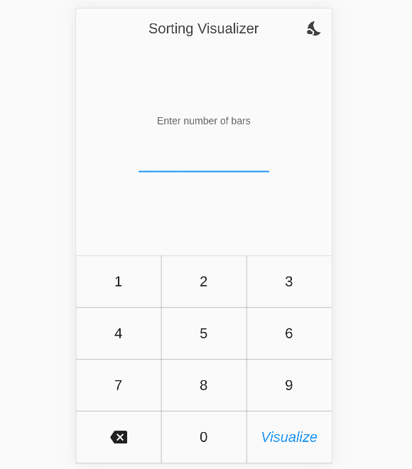
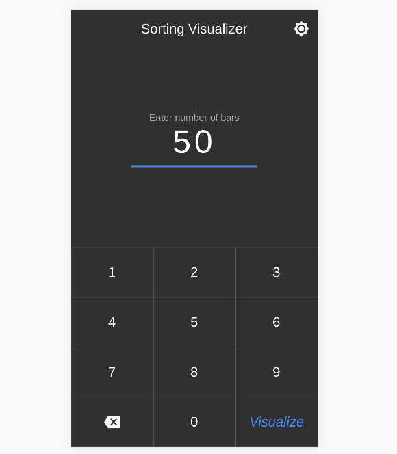

# FlutterSort

## Sorting Algorithms

- Bubble Sort
- Insertion Sort
- Selection Sort
- Merge Sort
- Quick Sort

## Demo

> Light Theme

    
    

> Dark Theme

    
    

## Libraries Used
- [provider](https://pub.dev/packages/provider)
- [flutter_bloc](https://pub.dev/packages/flutter_bloc)
- [hydrated_bloc](https://pub.dev/packages/hydrated_bloc)

 
